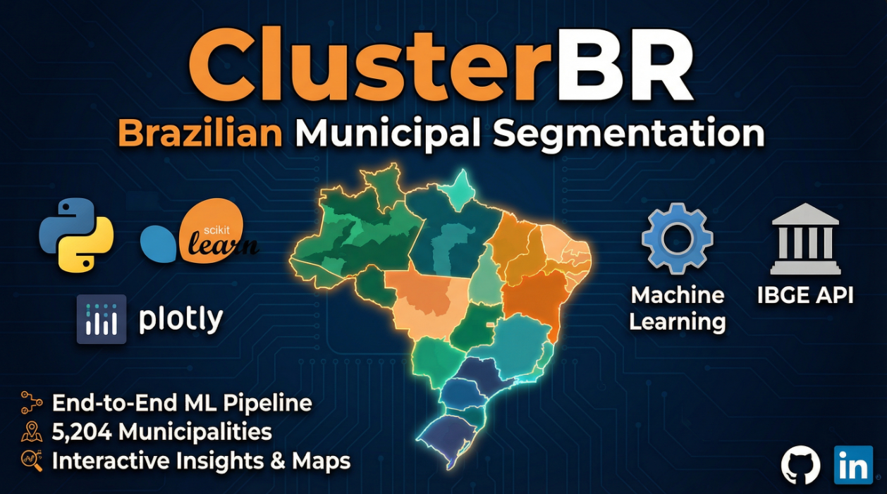

# ClusterBR — Segmentação de Municípios Brasileiros



## 📌 Visão Geral
Este projeto apresenta uma **análise completa de segmentação territorial do Brasil**, construída de ponta a ponta:  
**desde a coleta de dados via API do IBGE**, passando por **tratamento, feature engineering e avaliação de múltiplos algoritmos**, até a entrega de um **relatório interativo com visualizações dinâmicas**.

O objetivo é demonstrar domínio de **todo o ciclo de dados em Machine Learning não supervisionado**, com foco em **geração de insights acionáveis para políticas públicas e estratégias de negócio**.

---

## 🎯 Objetivos do Projeto
- Construir um pipeline completo de ML (coleta → modelagem → análise → visualização)
- Segmentar os **5.204 municípios brasileiros** com base em indicadores socioeconômicos do IBGE
- Explorar múltiplas abordagens de clustering e comparar resultados com métricas objetivas
- Aplicar técnicas como **PCA, Silhouette Score, Davies-Bouldin, Elbow Method e Ensemble Clustering**
- Transformar dados complexos em **insights territoriais interpretáveis**

---

## 🛠️ Tecnologias Utilizadas
- **Python** (Pandas, NumPy, Scikit-learn, Plotly, Matplotlib, Seaborn)
- **Jupyter Notebooks** (pipeline estruturado em 10 etapas)
- **API IBGE / SIDRA** (extração de dados municipais)
- **Algoritmos:** KMeans, Mini-Batch KMeans, Agglomerative Clustering, HDBSCAN
- **Redução de dimensionalidade:** PCA, t-SNE
- **Visualização interativa:** Plotly + HTML/CSS (relatório publicável)
- **GitHub** (documentação e portfólio)

---

## 🔄 Pipeline de Dados (End-to-End)

### 1️⃣ Configuração do Ambiente
Estruturação do projeto, instalação de dependências e criação do `requirements.txt` para garantir reprodutibilidade.

---

### 2️⃣ Coleta de Dados
Dados coletados via **API IBGE/SIDRA**, simulando um cenário real de integração com fontes públicas:
- Lista completa dos 5.204 municípios
- Dados de população, PIB per capita e área territorial
- Indicadores complementares de saúde, saneamento e desenvolvimento

> Essa abordagem reflete cenários reais onde os dados não chegam "prontos" — exigindo consumo de endpoints, estruturação e padronização.

---

### 3️⃣ Análise Exploratória (EDA)
Inspeção dos dados brutos, identificação de distribuições, correlações e padrões regionais antes da modelagem.

---

### 4️⃣ Pré-processamento
Realizado com Pandas e Scikit-learn, incluindo:
- Tratamento de valores ausentes
- Remoção de outliers extremos
- Criação de features derivadas (densidade demográfica, índices compostos)
- Seleção e normalização das variáveis finais para clustering

---

### 5️⃣ Determinação do K Ideal — Busca Exaustiva
Avaliação rigorosa com múltiplas métricas para definir o número ideal de clusters:
- **Elbow Method** (inércia)
- **Silhouette Score**
- **Davies-Bouldin Index**
- **Calinski-Harabasz Score**

Resultado: **K = 4** selecionado como modelo base.

---

### 6️⃣ Modelagem Final
Treinamento do modelo KMeans com K=4, combinado com **PCA para visualização em 2D e 3D**:
- Análise dos centróides
- Avaliação de separação entre grupos
- Visualizações interativas com Plotly

---

### 7️⃣ Análise e Interpretação dos Clusters
Cada cluster recebeu um perfil detalhado e nome interpretável, com identificação dos municípios mais representativos de cada grupo.

---

### 8️⃣ Visualização Geográfica
Mapas coroplético e de pontos para análise da distribuição espacial dos clusters por estado e região.

---

### 9️⃣ Comparação de Algoritmos
Teste e comparação de múltiplos algoritmos de clustering:
- KMeans (baseline)
- KMeans + PCA
- Mini-Batch KMeans
- HDBSCAN
- Agglomerative Clustering

---

### 🔟 Melhorias Avançadas + 3 Linhas de Pesquisa
A etapa final aprofunda a análise por três abordagens complementares:

| Linha | Abordagem | Descrição |
|-------|-----------|-----------|
| 1 | Hierárquica | Subclusters dentro de cada grupo K=4 (→ 16 grupos) |
| 2 | K=10 | Granularidade maior com clustering direto |
| 3 | Regional | KMeans + PCA por região, com K automático via silhueta |

Inclui ainda **Ensemble Clustering**, análise de estabilidade, t-SNE e feature importance.

---

## 📊 Estrutura do Relatório Interativo

### 📄 Seção 1 — Introdução e Objetivo
KPIs do projeto: municípios analisados, variáveis utilizadas, linhas de pesquisa e cobertura total.

### 📄 Seção 2 — Dados
Descrição das fontes, variáveis coletadas e processo de integração via API IBGE.

### 📄 Seção 3 — Análise Exploratória
Distribuições, correlações e padrões identificados antes da modelagem.

### 📄 Seção 4 — Pré-processamento e Variáveis
Features selecionadas e transformações aplicadas ao dataset final.

### 📄 Seção 5 — Busca Exaustiva do K
Curvas de métricas e justificativa para escolha do K=4.

### 📄 Seção 6 — Modelo Base (K=4)
Resultados do clustering principal com análise de centróides e visualizações PCA.

### 📄 Seção 7 — Perfil dos Grupos
Características, nomes e municípios representativos de cada cluster.

### 📄 Seção 8 — Mapas
Distribuição geográfica dos clusters no território brasileiro.

### 📄 Seção 9 — Linha 1: Hierárquica
Subclusters dentro de K=4 com dendrograma e análise comparativa.

### 📄 Seção 10 — Linha 2: K=10
Análise de granularidade fina com heatmap e radar por grupo.

### 📄 Seção 11 — Linha 3: Regional
Segmentação por região com K ótimo automático e comparação de silhuetas.

### 📄 Seção 12 — Comparação das 3 Linhas
Silhueta, Davies-Bouldin e scatter de complexidade vs. qualidade entre todas as abordagens.

### 📄 Seção 13 — Validação e Conclusão
Resumo dos resultados, recomendações de uso e próximos passos.

---

## 🔍 Principais Insights
- A **Linha 3 Regional** apresentou o melhor Silhouette Score (0,225 vs. 0,158 do modelo base), demonstrando que respeitar a heterogeneidade regional melhora significativamente a coesão dos grupos
- O **Nordeste** é a região com maior complexidade interna — necessitando de K=5 para segmentação adequada
- Existe forte concentração de municípios de baixo desenvolvimento no Norte e interior do Nordeste
- O modelo K=10 (Linha 2) oferece o melhor **Davies-Bouldin** entre os modelos comparáveis, sendo indicado para análises mais granulares

---

## 🗂️ Estrutura do Repositório

```
projeto_5/
│
├── 00_configuracao_inicial.ipynb
├── 01_coleta_dados.ipynb
├── 02_analise_exploratoria.ipynb
├── 03_preprocessamento.ipynb
├── 04_determinacao_clusters.ipynb
├── 05_modelagem_final.ipynb
├── 06_analise_clusters.ipynb
├── 07_visualizacao_mapas.ipynb
├── 08_comparacao_modelos.ipynb
├── 09_melhorias_avancadas.ipynb
├── 10_tres_linhas_pesquisa.ipynb
│
├── index.html          ← Relatório interativo
├── requirements.txt
└── README.md
```

---

## 🔗 Acesso ao Relatório Interativo
👉 [**Visualizar Relatório**](https://guicorrea93.github.io/PortifolioProjetos/projeto_5/index.html)

---

## 👤 Autor

**Guilherme Quaglio Corrêa**  
Analista de BI | Power BI | SQL | Python | Machine Learning

---

## 🏁 Considerações Finais

Este projeto foi desenvolvido com foco em cenários reais de análise territorial, cobrindo desde a origem dos dados (API pública) até a entrega de um relatório executivo interativo, reforçando habilidades de:
- Engenharia de features para dados socioeconômicos
- Avaliação rigorosa de modelos não supervisionados
- Storytelling analítico com visualizações interativas
- Pensamento crítico sobre múltiplas abordagens de solução
